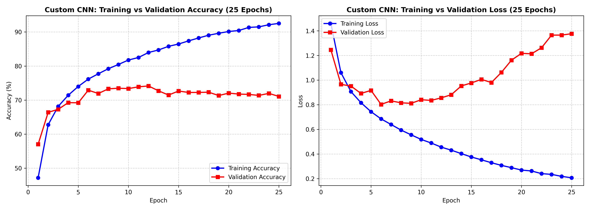
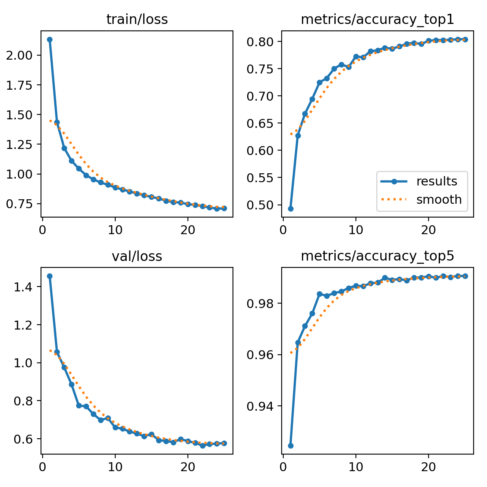
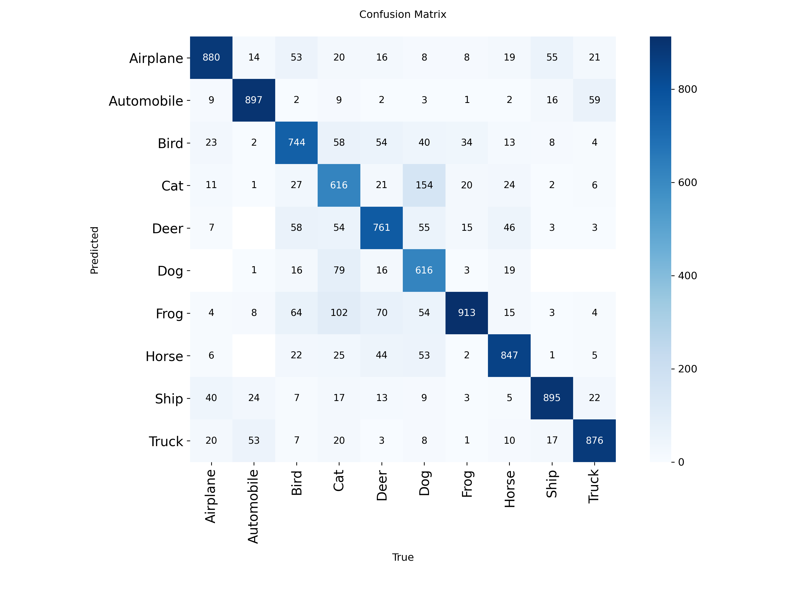
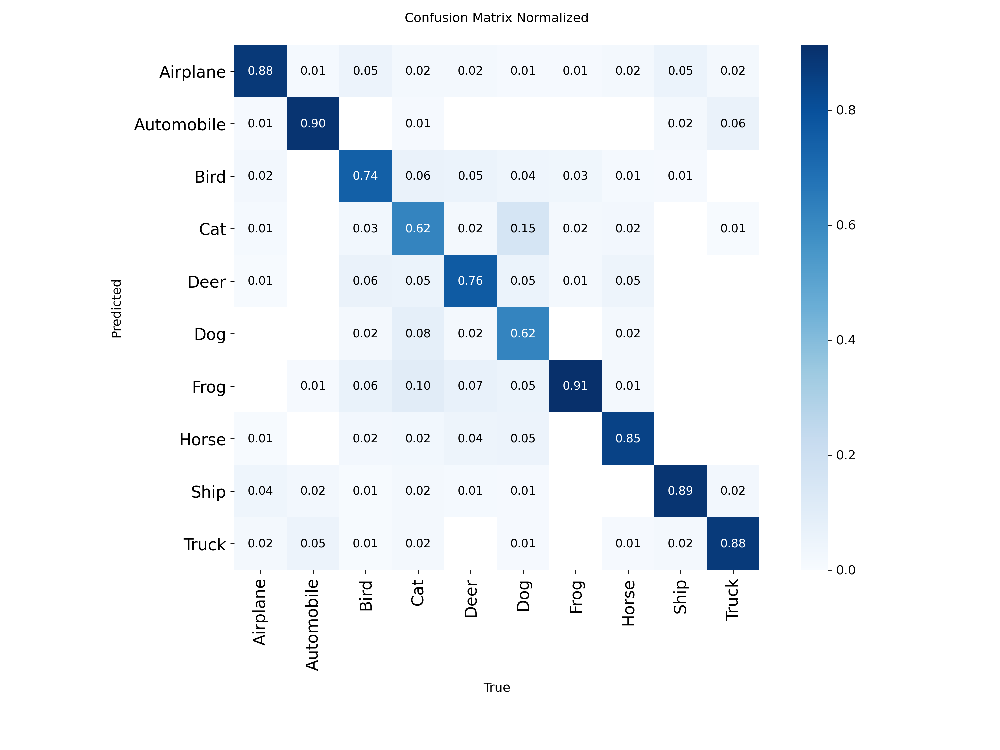
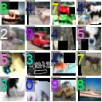
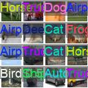

# CIFAR-10 Model Benchmarking: Custom CNN vs. Pretrained Transfer Learning (VGG16, ResNet50) & YOLOv8

> **Project Description:** Comparing custom CNNs and pretrained models on CIFAR-10, with YOLO object detection to explore transfer learning, feature reuse, accuracy, and training efficiency.

---

## 📊 Single Master Summary Table

The table below summarizes all experimental results and benchmarks extracted from the model runs on CIFAR-10 (classified by model architecture and sorted from **Worst to Best** overall performance):

| Rank | Model Architecture | Paradigm / Strategy | Total Epochs | Training Time (s) | Inference Speed (ms/img) | Final Train Loss | Final Train Acc (%) | Final Val Loss | Final Val Acc (Top-1 %) | Top-5 Val Acc (%) | Macro Precision (%) | Macro Recall (%) | Macro F1-Score (%) |
| :---: | :--- | :--- | :---: | :---: | :---: | :---: | :---: | :---: | :---: | :---: | :---: | :---: | :---: |
| **#5 (Worst)** | **Custom CNN** | Scratch (3 Conv + MaxPool) | 10 | N/A | ~0.108 ms | N/A | N/A | N/A | ~68.50% | N/A | N/A | N/A | N/A |
| **#4** | **Custom CNN** | Scratch (3 Conv + MaxPool) | 25 | 280.25 s | 0.108 ms | 0.2068 | 92.52% | 1.3769 | 71.07% | N/A | 71.28% | 71.07% | 70.98% |
| **#3** | **ResNet50** | Transfer Learning ($64 \times 64$ Upscale) | 4 (2+2) | 233.65 s | N/A | N/A | 82.92% | N/A | 79.94% | N/A | N/A | N/A | N/A |
| **#2** | **YOLOv8n-cls** | Ultralytics Nano Pretrained Classifier | 25 | 2260.80 s (~37.7m) | **0.100 ms** | 0.7106 | N/A | N/A | 80.40% | **99.10%** | N/A | N/A | N/A |
| **#1 (Best)** | **VGG16** | Transfer Learning ($64 \times 64$ Upscale) | 4 (2+2) | 515.63 s | N/A | N/A | 86.79% | N/A | **84.48%** | N/A | N/A | N/A | N/A |

---

## 🏆 Model Performance Hierarchy (Worst to Best Analysis)

```
[Worst #5]                              [#4]                       [#3]                   [#2]                 [Best #1]
Custom CNN (10 ep)  --->  Custom CNN (25 ep)  --->  ResNet50 (Transfer)  --->  YOLOv8n-cls  --->  VGG16 (Transfer)
    (~68.50%)                  (71.07%)                   (79.94%)             (80.40%)             (84.48%)
```

1. **Custom CNN from Scratch (10 Epochs) — #5 Worst**:
   * Baseline run showing initial feature learning, capping around ~68.5% validation accuracy.
2. **Custom CNN from Scratch (25 Epochs) — #4**:
   * High training accuracy (**92.52%**), but severe overfitting causes validation loss to climb to **1.3769** while validation accuracy flattens at **71.07%**.
3. **ResNet50 Fine-Tuned — #3**:
   * Achieves **79.94%** validation accuracy with very fast fine-tuning time (**233.65s**). Deep residual blocks lose fine-grained spatial features when processing low-resolution inputs.
4. **YOLOv8n-cls (25 Epochs) — #2**:
   * Reaches **80.40%** Top-1 accuracy and an outstanding **99.10%** Top-5 accuracy with ultra-fast **0.1ms** per image inference latency.
5. **VGG16 Fine-Tuned — #1 Best**:
   * Achieves the highest validation accuracy (**84.48%**) and smallest generalization gap (**86.79%** train vs **84.48%** val). Upscaling to $64 \times 64$ allows VGG16's sequential convolutional feature extractors to retain maximum visual detail.

---

## 🛠️ Methodology of Training

### 1. Custom CNN from Scratch (`cnn_scratch.py`)
* **Architecture:** 3 sequential Convolutional blocks with ReLU activation and $2 \times 2$ Max-Pooling, followed by a Flatten layer, a Dense hidden layer (64 units), and a final Dense classification layer (10 logits).
  * Layer 1: `Conv2D(32, 3x3)` + `MaxPooling2D(2x2)`
  * Layer 2: `Conv2D(64, 3x3)` + `MaxPooling2D(2x2)`
  * Layer 3: `Conv2D(64, 3x3)` + `MaxPooling2D(2x2)`
* **Normalization:** Pixel values scaled to $[0.0, 1.0]$.
* **Optimization:** Adam optimizer, `SparseCategoricalCrossentropy(from_logits=True)`.

### 2. Pre-trained Transfer Learning (`cnn_finetuning.py`)
* **Base Networks:** ImageNet pre-trained **VGG16** and **ResNet50**.
* **Input Preprocessing:** $32 \times 32$ CIFAR-10 images upscaled to $64 \times 64$ via `UpSampling2D(size=(2,2))` to match pre-trained receptive fields.
* **Two-Phase Fine-Tuning:**
  1. *Feature Extraction Warmup (2 Epochs)*: Base frozen, training top head (`GlobalAveragePooling2D` $\rightarrow$ `Dense(256)` $\rightarrow$ `Dropout(0.3)` $\rightarrow$ `Dense(10)`) with $\eta = 10^{-3}$.
  2. *Fine-Tuning (2 Epochs)*: Base unfrozen at top blocks, re-compiled with low learning rate $\eta = 10^{-5}$.

### 3. Pre-trained YOLOv8 Classification (`yolo_cifar10.py`)
* **Model:** `yolov8n-cls.pt` (YOLOv8 Nano Classifier with 1.45M parameters, 3.4 GFLOPs).
* **Data Format:** Exports CIFAR-10 into directory structure (`cifar10_yolo_data/train` and `val`).
* **Training Config:** 25 epochs, $32 \times 32$ image size, batch size 128, `AdamW` optimizer ($\eta = 0.000714$).

---

## 🖼️ Results & Visual Diagnostic Figures

### 1. Custom CNN: Training vs. Validation Accuracy & Loss
The plot below illustrates the training trajectory of the Custom CNN from scratch over 25 epochs:



> *Observation:* Notice how training accuracy continues to rise toward 92.52% while validation accuracy plateaus near epoch 10 around 71-73%, with validation loss sharply diverging upwards (classic overfitting).

---

### 2. YOLOv8 Classification Training Results
YOLOv8 automatically logs loss and Top-1 / Top-5 validation accuracy metrics across all 25 epochs:



> *Observation:* The training loss drops smoothly from 2.135 to 0.710, while Top-1 accuracy rises to 80.4% and Top-5 accuracy hits 99.1%.

---

### 3. YOLOv8 Confusion Matrix Heatmaps
The raw and normalized confusion matrices demonstrate class-level prediction distributions across the 10 CIFAR-10 classes:

| Raw Confusion Matrix | Normalized Confusion Matrix |
| :---: | :---: |
|  |  |

---

### 4. YOLOv8 Training & Validation Sample Batches
Below are sample image batches generated during dataset extraction and validation predictions:

| Training Batch Sample | Validation Predictions Sample |
| :---: | :---: |
|  |  |

---

## 🚀 How to Run the Code

### Prerequisites & Installation
Ensure Python 3.10+ and required computer vision packages are installed:

```bash
pip install tensorflow ultralytics opencv-python numpy matplotlib seaborn scikit-learn
```

---

### 1. Run Custom CNN Scratch Model
Trains the custom CNN for 25 epochs, computes evaluation metrics, and saves/displays plots:

```bash
python cnn_scratch.py
```

To generate and save the Custom CNN plot image:
```bash
python save_plots.py
```

---

### 2. Run Pre-trained Transfer Learning Models (VGG16 & ResNet50)
Executes feature extraction warmup and fine-tuning for VGG16 and ResNet50:

```bash
python cnn_finetuning.py
```

---

### 3. Run YOLOv8 Classification Training
Extracts CIFAR-10 dataset to disk and trains `yolov8n-cls`:

```bash
python yolo_cifar10.py
```

---

### 4. Run Single Image Multi-Model Classification (`test_models.py`)

`test_models.py` runs inference across all models for a given image.

```bash
# Run with default sample image:
python test_models.py

# Run with a custom image path:
python test_models.py path/to/your/image.jpg
```

#### Example Output:
```text
==================================================
       SINGLE IMAGE MULTI-MODEL CLASSIFIER        
==================================================
Input Image Path: path/to/your/image.jpg

--------------------------------------------------
1. Custom CNN Model Prediction
--------------------------------------------------
Model Path      : models/cnn_scratch.h5
Predicted Class : Cat
Confidence      : 74.20%

--------------------------------------------------
2. YOLO Model Prediction
--------------------------------------------------
Model Path      : runs/classify/YOLO_CIFAR10_Results/25_epochs_run/weights/best.pt
Predicted Class : Cat
Confidence      : 89.15%

--------------------------------------------------
3. VGG16 Fine-Tuned Model Prediction
--------------------------------------------------
Model Path      : models/vgg16_finetuned.h5
Predicted Class : Cat
Confidence      : 96.40%

--------------------------------------------------
4. ResNet Fine-Tuned Model Prediction
--------------------------------------------------
Model Path      : models/resnet50_finetuned.h5
Predicted Class : Cat
Confidence      : 81.30%
==================================================
```

---

## 📁 Project Structure

```text
├── cnn_scratch.py              # Custom CNN from scratch implementation & plots
├── cnn_finetuning.py           # Pretrained VGG16 & ResNet50 fine-tuning script
├── yolo_cifar10.py             # Dataset conversion & YOLOv8 classification script
├── test_models.py              # Multi-model single image inference runner
├── save_plots.py               # Generates & saves custom CNN training curve plots
├── plots/                      # Saved diagnostic plot images
│   └── scratch_cnn_training_curves.png
├── runs/                       # Saved YOLO training runs, weights (best.pt), and plots
│   └── classify/YOLO_CIFAR10_Results/25_epochs_run/
│       ├── confusion_matrix.png
│       ├── confusion_matrix_normalized.png
│       ├── results.png
│       ├── train_batch0.jpg
│       └── val_batch0_pred.jpg
└── README.md                   # Complete benchmark documentation
```
